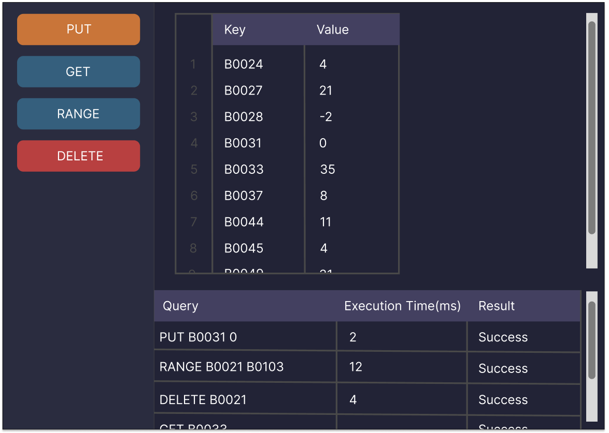
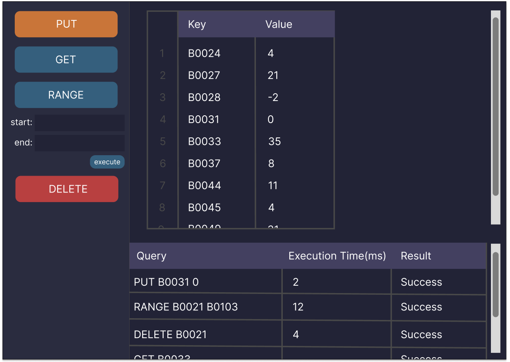

# 홈페이지 프로토타입

## 홈페이지 메인 화면



1. 실행한 쿼리의 결과 테이블을 확인할 수 있다.
2. 왼쪽 사이드바에서 PUT, GET, RANGE, DELETE 쿼리를 실행할 수 있다.
3. 결과 테이블 아래에서 실행한 쿼리 로그를 확인할 수 있다.
4. 쿼리 로그를 클릭하면 해당 쿼리의 결과 테이블로 변경된다.

## 쿼리 실행 버튼 클릭시



1. 쿼리 실행 버튼을 클릭 시 제출할 수 있는 form이 생성된다.
2. execute 버튼을 클릭시 쿼리가 데이터베이스로 제출된다.

# 프로젝트 설정

1. npm install로 의존성 설치
2. npm install -D tailwindcss postcss autoprefixer로 tailwind 의존성 다운로드
3. npx tailwindcss init으로 tailwind 의존성 init
4. tailwind.config.js를 다음과 같이 작성

```javascript
/** @type {import('tailwindcss').Config} */
const colors = require('tailwindcss/colors')

module.exports = {
  content: ["./src/**/*.{jsx,js}"],
  theme: {
    extend: {
      colors: {
        'matisse': '#355F7D',
      },
    },
    extend: {},
  },
  plugins: [],
}
```